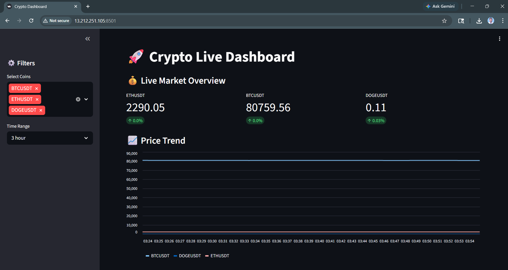
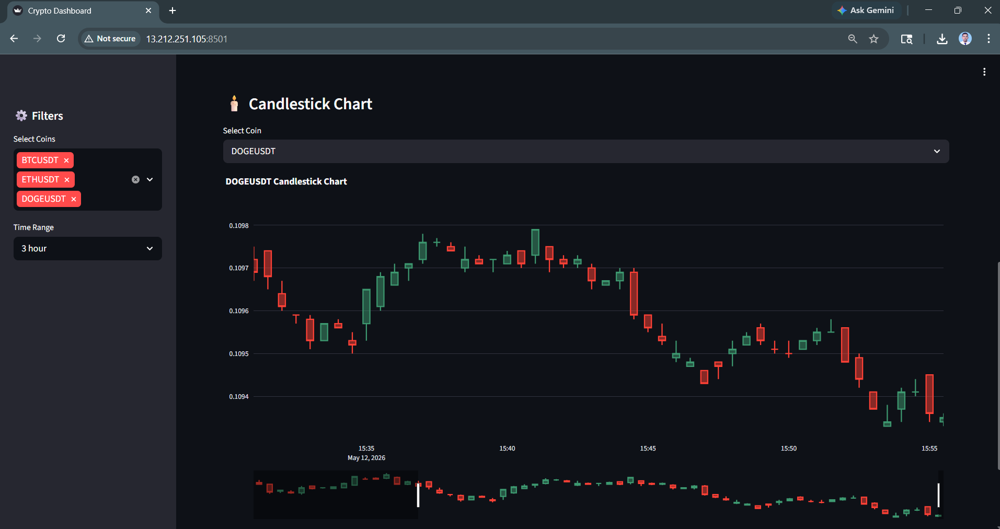

# crypto-realtime-pipeline
# 🚀 Real-Time Crypto Data Engineering Pipeline

This project started as an attempt to better understand how real-time streaming systems work beyond tutorials and static datasets.

The idea was simple:

* fetch live crypto prices continuously
* stream the data through Kafka
* process it using multiple consumers
* store it in PostgreSQL
* and visualize everything on a live dashboard

While building it, I explored several practical data engineering concepts including Kafka partitioning, consumer groups, batch inserts, Docker-based deployment, and AWS hosting.

The pipeline is fully containerized and designed to simulate a lightweight real-time production workflow.

---

# 📌 Architecture

```text
Binance API
     ↓
Kafka Producer
     ↓
Kafka Topic (3 Partitions)
     ↓
Kafka Consumer Group (Multiple Consumers)
     ↓
PostgreSQL
     ↓
Streamlit Dashboard
```

---

## Dashboard






# 🛠️ Tech Stack

| Component            | Technology              |
| -------------------- | ----------------------- |
| Streaming Platform   | Apache Kafka            |
| Coordination Service | Zookeeper               |
| Producer/Consumer    | Python                  |
| Database             | PostgreSQL              |
| Dashboard            | Streamlit + Plotly      |
| Containerization     | Docker + Docker Compose |
| Cloud                | AWS EC2                 |
| Data Source          | Binance API             |

---

# ✨ Features

## ✅ Real-Time Data Streaming

The producer continuously fetches live market prices and pushes events into Kafka topics in near real time.

## ✅ Kafka Partitioning

The Kafka topic is configured with multiple partitions so that events can be distributed efficiently across consumers.

## ✅ Consumer Groups

Multiple consumers can process data in parallel using the same consumer group, making the pipeline scalable.

## ✅ Batch Database Writes

Instead of inserting records one by one, the consumer performs batch inserts into PostgreSQL to reduce overhead and improve performance.

## ✅ Interactive Dashboard

The Streamlit dashboard provides:

* live price updates
* line charts
* candlestick charts
* filtering options
* real-time metrics

## ✅ Dockerized Setup

All services run through Docker Compose, making the project easy to start, stop, and deploy.

## ✅ AWS Deployment

The complete pipeline was deployed on AWS EC2 to simulate a cloud-based real-time environment.

---

# 📂 Project Structure

```text
crypto-realtime-pipeline/
│
├── producer.py          # Kafka producer (Binance API → Kafka)
├── consumer.py          # Kafka consumer (Kafka → PostgreSQL)
├── app.py               # Streamlit dashboard
├── Dockerfile           # Common Docker image
├── requirements.txt     # Python dependencies
├── docker-compose.yml   # Multi-container orchestration
└── README.md
```

---

# ⚙️ Kafka Design

## Topic Configuration

```text
Topic Name: crypto-topic
Partitions: 3
Replication Factor: 1
```

---

## Producer Strategy

Messages are sent using:

```python
key=symbol.encode('utf-8')
```

This ensures:

* Same coin goes to same partition
* Ordered processing per coin
* Better scalability

---

## Consumer Group

```text
Group ID: crypto-consumer-group
```

Benefits:

* Parallel processing
* Fault tolerance
* Horizontal scalability

---

# 📊 Dashboard Features

## Live Market Overview

Displays:

* Latest coin prices
* Percentage change
* Real-time metrics

## Line Charts

* Multi-coin trend analysis
* Time range filtering
* Live updates

## Candlestick Charts

* OHLC aggregation
* Interactive zoom
* Professional visualization

## Filters

* Coin selection
* Dynamic time windows

---

# 🐳 Docker Deployment

## Start Entire Pipeline

```bash
docker-compose up -d
```

---

## Stop Pipeline

```bash
docker-compose down
```

---

# ☁️ AWS Deployment

## EC2 Configuration

| Component     | Value                   |
| ------------- | ----------------------- |
| OS            | Ubuntu Server 24.04 LTS |
| Instance Type | t3.small                |
| Storage       | 20 GB gp3               |

---

## Open Ports

| Port | Purpose             |
| ---- | ------------------- |
| 22   | SSH                 |
| 8501 | Streamlit Dashboard |
| 8081 | Kafka UI            |
| 9092 | Kafka Broker        |
| 5432 | PostgreSQL          |

---

# 📈 Possible Improvements

A few enhancements that can be added in future iterations:

* Spark Structured Streaming for large-scale stream processing
* Airflow for orchestration and scheduling
* Redis caching for faster dashboard reads
* Kubernetes deployment
* CI/CD automation
* Monitoring and alerting
* Multi-broker Kafka setup
* Historical analytics layer

---

# 🧠 Concepts Practiced Through This Project

* Real-time streaming pipelines
* Distributed messaging systems
* Event-driven architecture
* Kafka partitioning
* Consumer groups
* Batch processing
* Cloud deployment
* Docker containerization
* Real-time analytics
* Database optimization

---

# 🚀 How To Run Locally

## Clone Repository

```bash
git clone https://github.com/mukuldhote/crypto-realtime-pipeline.git
cd crypto-realtime-pipeline
```

---

## Start Pipeline

```bash
docker-compose up --build
```

---

## Access Applications

| Service   | URL                                            |
| --------- | ---------------------------------------------- |
| Dashboard | [http://localhost:8501](http://localhost:8501) |
| Kafka UI  | [http://localhost:8081](http://localhost:8081) |

---

# 💡 What I Learned

This project gave me hands-on exposure to:

* designing real-time pipelines
* working with Kafka producers and consumers
* understanding partitioning and consumer groups
* optimizing inserts into PostgreSQL
* handling Docker networking issues
* deploying streaming applications on AWS
* building live dashboards with Streamlit
* troubleshooting distributed system issues in cloud environments

One interesting challenge during deployment was handling Binance API restrictions from certain cloud IP ranges. Solving infrastructure and connectivity issues like these made the project feel much closer to a real-world deployment scenario.

---

# 👨‍💻 Author

## Mukul Dhote

Data Engineer passionate about:

* Real-time data systems
* Big data technologies
* Cloud-native architectures
* Streaming analytics

---

# ⭐ If You Like This Project

* Star the repository
* Fork the project
* Connect on LinkedIn
* Share feedback
