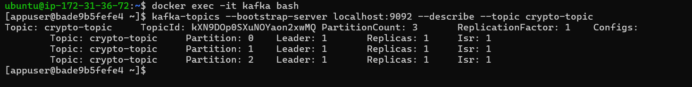
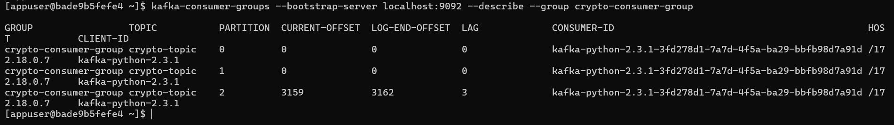
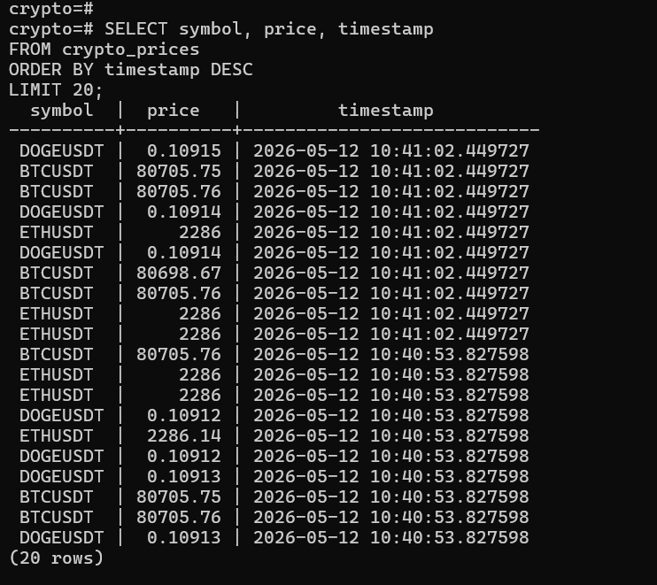
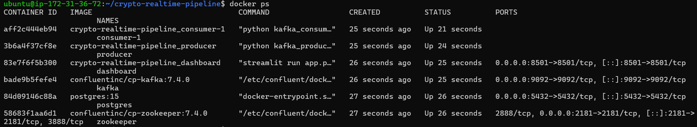
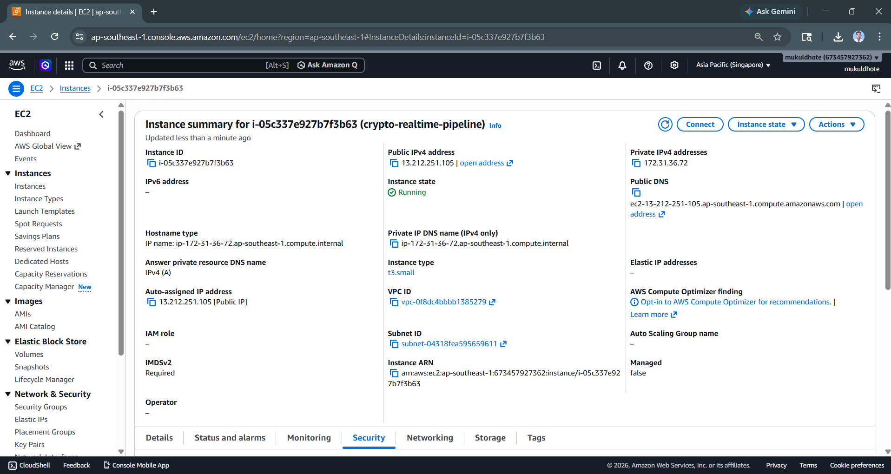
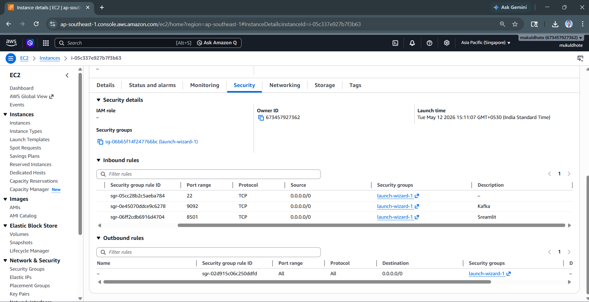

# crypto-realtime-pipeline

I built this to get hands-on with real-time streaming — the kind of thing you can't fully grasp just by reading docs or following along with a tutorial dataset that never changes.

The idea was to wire together a pipeline that actually moves: pull live prices from Binance, route them through Kafka, fan out to multiple consumers, land in Postgres, and surface everything on a dashboard that updates as data comes in. Nothing revolutionary, but building it yourself is a different experience than reading about it.

---

## How it works

```
Binance API → Kafka Producer → Kafka Topic (3 partitions) → Consumer Group → PostgreSQL → Streamlit Dashboard
```

---

## Dashboard


---

## Stack

| Component | Technology |
|---|---|
| Streaming | Apache Kafka + Zookeeper |
| Producer / Consumer | Python |
| Database | PostgreSQL |
| Dashboard | Streamlit + Plotly |
| Containers | Docker + Docker Compose |
| Cloud | AWS EC2 |
| Data Source | Binance API |

---

## Project structure

```
crypto-realtime-pipeline/
├── producer.py        # pulls from Binance, pushes to Kafka
├── consumer.py        # reads from Kafka, writes to Postgres
├── app.py             # Streamlit dashboard
├── Dockerfile
├── requirements.txt
└── docker-compose.yml
```

---

## Kafka setup

**Topic config**
```
Topic: crypto-topic
Partitions: 3
Replication Factor: 1
```



**Keying by symbol**

```python
key=symbol.encode('utf-8')
```

Keeps each coin consistently routed to the same partition, which matters for ordering and makes it easier to scale consumers later.

**Consumer group**

```
Group ID: crypto-consumer-group
```

Spin up more consumers and Kafka redistributes the partitions automatically. Makes horizontal scaling almost trivial.



---

## A couple of implementation details worth mentioning

**Batch writes** — instead of inserting one row at a time, the consumer accumulates records and flushes in batches. The difference in write throughput is pretty significant, and it's one of those optimizations that's easy to skip but hard to ignore once you see the numbers.



**Dashboard** — live price updates, line charts for multi-coin trend comparison, candlestick charts with OHLC aggregation, coin selector, and a time window filter. Built with Streamlit and Plotly, auto-refreshes as new data lands.

---

## Docker deployment

All services are containerized and orchestrated through Docker Compose — Kafka, Zookeeper, Postgres, the producer, consumer, and dashboard all come up together.

**Start the entire pipeline**

```bash
docker-compose up -d
```


**Stop the pipeline**

```bash
docker-compose down
```

## AWS deployment

Deployed the full stack on EC2 to see how it holds up outside of localhost.

|---|---|
| OS | Ubuntu Server 24.04 LTS |
| Instance | t3.small |
| Storage | 20 GB gp3 |

**Ports**

| Port | Service |
|---|---|
| 22 | SSH |
| 8501 | Streamlit |
| 8081 | Kafka UI |
| 9092 | Kafka Broker |
| 5432 | PostgreSQL |





One thing that caught me off guard: Binance restricts API access from certain AWS IP ranges. Didn't see that coming, and working through it was probably the most genuinely real-world part of the whole project.

---

## What I'd change or add

- Swap Docker Compose for Kubernetes once you need real resilience
- Add Spark Structured Streaming if the volume gets serious
- Airflow for scheduling and pipeline orchestration
- Redis in front of the dashboard for faster reads
- Proper monitoring and alerting — currently flying blind on failures
- Multi-broker Kafka for actual fault tolerance
- A historical analytics layer alongside the real-time feed

---

## Running locally

**Clone the repository**

```bash
git clone https://github.com/mukuldhote/crypto-realtime-pipeline.git
cd crypto-realtime-pipeline
```

**Start the pipeline**

```bash
docker-compose up --build
```

**Access the apps**

| Service | URL |
|---|---|
| Dashboard | http://localhost:8501 |
| Kafka UI | http://localhost:8081 |

---

## What I actually took away from this

Docker networking was the first real headache. Getting Kafka, Postgres, and Streamlit to find each other inside Compose took longer than I expected, and the error messages aren't always helpful.

The batch insert change was one of those small things that made a clear, measurable difference. And watching the consumer group rebalance partitions when I added a new consumer made the concept click in a way that no amount of reading had managed.

Deploying to EC2 and hitting the Binance restriction was a good reminder that production environments have friction that local dev quietly hides.

---

Built by [Mukul Dhote](https://github.com/mukuldhote) — feel free to fork it, open an issue, or connect on LinkedIn if you're working on something similar.
